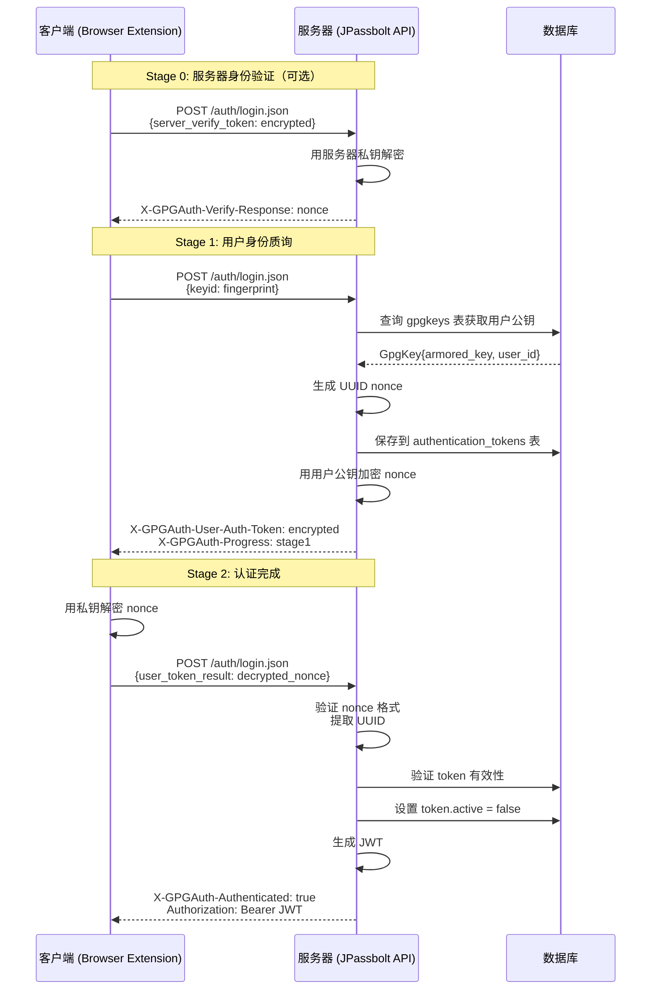

# Passbolt GPG 认证流程详解

## 概述

Passbolt 使用基于 OpenPGP 的质询-响应认证机制，这是一种不依赖密码的认证方式。整个流程分为三个阶段（Stage 0、Stage 1、Stage 2），通过加密/解密操作验证双方身份。

## 核心原理

```
┌─────────────────────────────────────────────────────────────────────────────┐
│                         Passbolt GPG 认证原理                                │
├─────────────────────────────────────────────────────────────────────────────┤
│                                                                             │
│  1. 零知识服务器：服务器永远不会看到用户的私钥或明文密码                         │
│  2. 端到端加密：所有敏感数据仅在客户端加密/解密                                 │
│  3. 质询-响应：通过加密消息证明身份，而非传输密码                               │
│                                                                             │
└─────────────────────────────────────────────────────────────────────────────┘
```

## CakePHP 认证架构

### 从 Controller 到 Authenticator 的完整调用链

当客户端发起 `POST /auth/login.json` 请求时，请求会经过以下调用链最终到达 `GpgAuthenticator`:

```
┌─────────────────────────────────────────────────────────────────────────────┐
│  1. HTTP 请求: POST /auth/login.json                                        │
│                           ↓                                                 │
│  2. Application::middleware() - 中间件队列注册                               │
│     → AuthenticationMiddleware($this)                                       │
│                           ↓                                                 │
│  3. AuthenticationMiddleware::process()                                     │
│     → 调用 $app->getAuthenticationService($request)                         │
│                           ↓                                                 │
│  4. Application::getAuthenticationService()                                 │
│     → 从 DI 容器获取 SessionAuthenticationService                            │
│                           ↓                                                 │
│  5. SessionAuthenticationService::__construct()                             │
│     → $this->loadAuthenticator('Authentication.Session')                    │
│     → $this->loadAuthenticator('Gpg')  ← 加载 GpgAuthenticator              │
│                           ↓                                                 │
│  6. AuthenticationMiddleware 调用 $service->authenticate($request)          │
│     → 遍历所有已注册的 Authenticator                                         │
│                           ↓                                                 │
│  7. GpgAuthenticator::authenticate()                                        │
│     → 根据请求数据决定调用 _stage0/1/2()                                     │
│                           ↓                                                 │
│  8. 认证结果存入 Request 属性                                                │
│                           ↓                                                 │
│  9. AuthLoginController::loginPost()                                        │
│     → $this->Authentication->getResult() 获取认证结果                        │
└─────────────────────────────────────────────────────────────────────────────┘
```

### 关键代码位置

#### 1. 中间件注册 ([Application.php](file:///Users/chaucer/Code/gitlab/jpassbolt/jpassbolt_api/passbolt_api_ref/src/Application.php#L123-L127))

```php
// 第 123-127 行
->insertAfter(
    SessionAuthPreventDeletedOrDisabledUsersMiddleware::class,
    new AuthenticationMiddleware($this)  // Application 实现了 AuthenticationServiceProviderInterface
)
->add(new GpgAuthHeadersMiddleware())
```

#### 2. 获取认证服务 ([Application.php](file:///Users/chaucer/Code/gitlab/jpassbolt/jpassbolt_api/passbolt_api_ref/src/Application.php#L316-L339))

```php
public function getAuthenticationService(ServerRequestInterface $request): AuthenticationServiceInterface
{
    // 从 DI 容器获取 SessionAuthenticationService
    $auth = $this->getContainer()->get(AuthenticationServiceInterface::class);
    return $auth;
}
```

#### 3. DI 容器注册 ([Application.php](file:///Users/chaucer/Code/gitlab/jpassbolt/jpassbolt_api/passbolt_api_ref/src/Application.php#L294))

```php
$container->add(AuthenticationServiceInterface::class, SessionAuthenticationService::class);
```

#### 4. 加载 GpgAuthenticator ([SessionAuthenticationService.php](file:///Users/chaucer/Code/gitlab/jpassbolt/jpassbolt_api/passbolt_api_ref/src/Authenticator/SessionAuthenticationService.php#L26-L33))

```php
public function __construct(array $config = [])
{
    parent::__construct($config);
    
    // Session 认证器优先
    $this->loadAuthenticator('Authentication.Session');
    // GPG 认证器
    $this->loadAuthenticator('Gpg');  // 映射到 App\Authenticator\GpgAuthenticator
}
```

#### 5. Controller 获取认证结果 ([AuthLoginController.php](file:///Users/chaucer/Code/gitlab/jpassbolt/jpassbolt_api/passbolt_api_ref/src/Controller/Auth/AuthLoginController.php#L85))

```php
// $this->Authentication 是 AuthenticationComponent，通过 AppController 加载
$result = $this->Authentication->getResult();
```

### CakePHP ORM 结构说明

在 CakePHP 中，**Entity** 和 **Table** 的关系：

| 组件 | 对应关系 | 职责 |
|------|----------|------|
| **Entity** (如 `AuthenticationToken`) | 表中的 **一行记录** | 定义字段属性、数据类型、访问器/修改器 |
| **Table** (如 `AuthenticationTokensTable`) | **整张表** | 查询、插入、更新、删除、定义关联关系 |

获取 Table 对象的方式：

```php
// 获取 AuthenticationTokensTable 实例
$AuthenticationToken = TableRegistry::getTableLocator()->get('AuthenticationTokens');

// 调用 Table 方法
$authenticationToken = $AuthenticationToken->generate($userId, AuthenticationToken::TYPE_LOGIN);
$AuthenticationToken->isValid($uuid, $userId, AuthenticationToken::TYPE_LOGIN);
$AuthenticationToken->setInactive($uuid);
```

### Java/Spring 对照实现

| CakePHP 概念 | Java/Spring 等效实现 |
|--------------|---------------------|
| `AuthenticationMiddleware` | `OncePerRequestFilter` |
| `SessionAuthenticationService` | Spring Security `AuthenticationManager` |
| `GpgAuthenticator` | 自定义 `AuthenticationProvider` 或 Filter |
| `$this->loadAuthenticator('Gpg')` | `@Autowired GpgAuthenticator` |
| `AuthenticationComponent` | `@Autowired AuthenticationService` |
| `Entity` (单行) | `@Entity` JPA 实体类 |
| `Table` (整表) | `@Repository` Spring Data JPA 接口 |

```java
// 示例：Java Filter 实现
@Component
public class GpgAuthenticationFilter extends OncePerRequestFilter {
    
    @Autowired
    private GpgAuthenticator gpgAuthenticator;
    
    @Override
    protected void doFilterInternal(HttpServletRequest request, ...) {
        AuthResult result = gpgAuthenticator.authenticate(request);
        request.setAttribute("authResult", result);
        filterChain.doFilter(request, response);
    }
}

// Controller 获取结果
@RestController
public class AuthLoginController {
    @PostMapping("/auth/login")
    public ResponseEntity<?> login(HttpServletRequest request) {
        AuthResult result = (AuthResult) request.getAttribute("authResult");
        // 处理认证结果...
    }
}
```

---

## 认证流程详解

### Stage 0: 服务器身份验证（可选）

客户端验证服务器身份，确保连接的是合法服务器。

```
┌──────────────┐                              ┌──────────────┐
│    Client    │                              │    Server    │
└──────┬───────┘                              └──────┬───────┘
       │                                             │
       │  1. 用服务器公钥加密一个随机 token            │
       │─────────────────────────────────────────────>│
       │     POST /auth/login.json                   │
       │     { server_verify_token: "encrypted..." } │
       │                                             │
       │  2. 服务器用私钥解密，返回明文               │
       │<─────────────────────────────────────────────│
       │     X-GPGAuth-Verify-Response: "token"      │
       │                                             │
       │  3. 客户端验证返回的 token 是否匹配          │
       │     ✓ 匹配 = 服务器身份已验证                │
       │                                             │
```

**PHP 参考代码** ([GpgAuthenticator.php](file:///Users/chaucer/Code/gitlab/jpassbolt/jpassbolt_api/passbolt_api_ref/src/Authenticator/GpgAuthenticator.php#L184-L207)):

```php
private function _stage0(): bool
{
    $serverVerifyToken = $this->_data['server_verify_token'] ?? '';
    $this->assertGpgMessageIsValid(
        $this->_gpg,
        $serverVerifyToken,
        __('The server verify token is missing or invalid.')
    );

    try {
        $nonce = $this->_gpg->decrypt($serverVerifyToken);
        if ($this->_checkNonce($nonce)) {
            $this->addHeader('X-GPGAuth-Verify-Response', $nonce);
        }
    } catch (Exception $e) {
        return $this->_error(__('Decryption failed.'));
    }

    return true;
}
```

---

### Stage 1: 用户身份质询

服务器生成一个随机 token，用用户的公钥加密后发送给客户端。

```
┌──────────────┐                              ┌──────────────┐
│    Client    │                              │    Server    │
└──────┬───────┘                              └──────┬───────┘
       │                                             │
       │  1. 发送 GPG 密钥指纹/ID                    │
       │─────────────────────────────────────────────>│
       │     POST /auth/login.json                   │
       │     { keyid: "fingerprint" }                │
       │                                             │
       │                    2. 服务器:                │
       │                    - 查找用户公钥            │
       │                    - 生成 UUID token        │
       │                    - 保存到 authentication_tokens │
       │                    - 用用户公钥加密 nonce    │
       │                                             │
       │  3. 返回加密后的 nonce                      │
       │<─────────────────────────────────────────────│
       │     X-GPGAuth-User-Auth-Token: "encrypted"  │
       │     X-GPGAuth-Progress: "stage1"            │
       │                                             │
```

**Nonce 格式:**
```
gpgauthv1.3.0|36|{UUID}|gpgauthv1.3.0
```

例如: `gpgauthv1.3.0|36|de305d54-75b4-431b-adb2-eb6b9e546014|gpgauthv1.3.0`

**PHP 参考代码** ([GpgAuthenticator.php](file:///Users/chaucer/Code/gitlab/jpassbolt/jpassbolt_api/passbolt_api_ref/src/Authenticator/GpgAuthenticator.php#L209-L247)):

```php
private function _stage1(): bool
{
    $this->addHeader('X-GPGAuth-Progress', 'stage1');

    // 初始化用户公钥
    try {
        $this->_initUserKey($this->_data['keyid']);
    } catch (Exception $e) {
        return $this->_error($e->getMessage());
    }

    // 设置服务器签名密钥
    $this->_gpg->setSignKeyFromFingerprint(
        Configure::read('passbolt.gpg.serverKey.fingerprint'),
        Configure::read('passbolt.gpg.serverKey.passphrase')
    );

    // 生成认证 token
    $AuthenticationToken = TableRegistry::getTableLocator()->get('AuthenticationTokens');
    $authenticationToken = $AuthenticationToken->generate(
        $this->_user->id, 
        AuthenticationToken::TYPE_LOGIN
    );

    // 加密并签名
    $token = 'gpgauthv1.3.0|36|' . $authenticationToken->token . '|gpgauthv1.3.0';
    $msg = $this->_gpg->encrypt($token, true);
    $msg = quotemeta(urlencode($msg));
    $this->addHeader('X-GPGAuth-User-Auth-Token', $msg);

    return true;
}
```

---

### Stage 2: 认证完成

客户端解密 nonce 并发回服务器，服务器验证后颁发会话。

```
┌──────────────┐                              ┌──────────────┐
│    Client    │                              │    Server    │
└──────┬───────┘                              └──────┬───────┘
       │                                             │
       │  4. 客户端用私钥解密 nonce                  │
       │                                             │
       │  5. 发送解密后的 nonce                      │
       │─────────────────────────────────────────────>│
       │     POST /auth/login.json                   │
       │     { user_token_result: "decrypted nonce" }│
       │                                             │
       │                    6. 服务器:                │
       │                    - 验证 nonce 格式        │
       │                    - 提取 UUID              │
       │                    - 验证 token 有效性      │
       │                    - 设置 token 为 inactive │
       │                    - 创建会话/JWT           │
       │                                             │
       │  7. 认证成功                                │
       │<─────────────────────────────────────────────│
       │     X-GPGAuth-Authenticated: "true"         │
       │     X-GPGAuth-Progress: "complete"          │
       │     Authorization: "Bearer {JWT}"           │
       │                                             │
```

**PHP 参考代码** ([GpgAuthenticator.php](file:///Users/chaucer/Code/gitlab/jpassbolt/jpassbolt_api/passbolt_api_ref/src/Authenticator/GpgAuthenticator.php#L249-L282)):

```php
private function _stage2(): bool
{
    $this->addHeader('X-GPGAuth-Progress', 'stage2');
    
    // 验证 nonce 格式
    if (!$this->_checkNonce($this->_data['user_token_result'])) {
        return $this->_error(__('The user token result should be a valid UUID.'));
    }

    // 从 nonce 中提取 UUID
    [$version, $length, $uuid, $version2] = explode('|', $this->_data['user_token_result']);

    // 验证 token
    $AuthenticationToken = TableRegistry::getTableLocator()->get('AuthenticationTokens');
    $isValidToken = $AuthenticationToken->isValid(
        $uuid, 
        $this->_user->id, 
        AuthenticationToken::TYPE_LOGIN
    );
    
    if (!$isValidToken) {
        return $this->_error(__('The user token result could not be found'));
    }

    // 设置 token 为 inactive
    $AuthenticationToken->setInactive($uuid);
    
    // 标记认证完成
    $this->addHeader('X-GPGAuth-Progress', 'complete')
         ->addHeader('X-GPGAuth-Authenticated', 'true')
         ->addHeader('X-GPGAuth-Refer', '/');

    return true;
}
```

---

## Nonce 格式验证

**PHP 参考代码** ([GpgAuthenticator.php](file:///Users/chaucer/Code/gitlab/jpassbolt/jpassbolt_api/passbolt_api_ref/src/Authenticator/GpgAuthenticator.php#L432-L464)):

```php
private function _checkNonce(mixed $nonce): bool
{
    if (!is_string($nonce)) {
        return $this->_error(__('Invalid verify token type.'));
    }

    $result = explode('|', $nonce);
    if (count($result) != 4) {
        return $this->_error('sections are missing or using wrong delimiters.');
    }
    
    [$version, $length, $uuid, $version2] = $result;
    
    if ($version != $version2) {
        return $this->_error('the version numbers do not match.');
    }
    if ($version != 'gpgauthv1.3.0') {
        return $this->_error('wrong version number.');
    }
    if ($version != Validation::uuid($uuid)) {
        return $this->_error('it is not a UUID.');
    }
    if ($length != 36) {
        return $this->_error('wrong token data length.');
    }

    return true;
}
```

---

## X-GPGAuth-* 响应头

| Header | 说明 | 值 |
|--------|------|-----|
| `X-GPGAuth-Authenticated` | 认证状态 | `true` / `false` |
| `X-GPGAuth-Progress` | 当前阶段 | `stage0` / `stage1` / `stage2` / `complete` |
| `X-GPGAuth-User-Auth-Token` | 加密的 nonce（Stage 1） | URL 编码的加密消息 |
| `X-GPGAuth-Verify-Response` | 解密的服务器验证 token（Stage 0） | 明文 nonce |
| `X-GPGAuth-Error` | 是否发生错误 | `true` |
| `X-GPGAuth-Debug` | 调试信息 | 错误消息 |
| `X-GPGAuth-Refer` | 认证后跳转地址 | `/` |

---

## Java 实现对照

### AuthService.java

```java
// Stage 1: 生成 Passbolt 格式的 nonce
String uuid = UUID.randomUUID().toString();
String nonce = formatNonce(uuid);  // "gpgauthv1.3.0|36|{UUID}|gpgauthv1.3.0"

// 存储 token
AuthenticationToken token = new AuthenticationToken();
token.setUserId(gpgKey.getUserId());
token.setToken(uuid);  // 只存储 UUID 部分
token.setType("login");
token.setActive(true);
tokenRepository.save(token);

// 用用户公钥加密 nonce
String encryptedNonce = gpgService.encrypt(nonce, gpgKey.getArmoredKey());
```

### AuthController.java

```java
// Stage 1 响应
headers.add("X-GPGAuth-Progress", "stage1");
String encodedToken = URLEncoder.encode(encryptedNonce, StandardCharsets.UTF_8);
headers.add("X-GPGAuth-User-Auth-Token", encodedToken);

// Stage 2 认证成功
headers.set("X-GPGAuth-Authenticated", "true");
headers.add("X-GPGAuth-Progress", "complete");
headers.add("Authorization", "Bearer " + jwt);
```

---

## 时序图



---

## 相关文件

### PHP 参考实现

| 文件 | 说明 |
|------|------|
| [GpgAuthenticator.php](file:///Users/chaucer/Code/gitlab/jpassbolt/jpassbolt_api/passbolt_api_ref/src/Authenticator/GpgAuthenticator.php) | 主认证器，包含 Stage 0/1/2 |
| [GpgAuthenticatorTrait.php](file:///Users/chaucer/Code/gitlab/jpassbolt/jpassbolt_api/passbolt_api_ref/src/Authenticator/GpgAuthenticatorTrait.php) | GPG 消息验证工具 |
| [AuthenticationToken.php](file:///Users/chaucer/Code/gitlab/jpassbolt/jpassbolt_api/passbolt_api_ref/src/Model/Entity/AuthenticationToken.php) | Token 实体定义 |
| [AuthenticationTokensTable.php](file:///Users/chaucer/Code/gitlab/jpassbolt/jpassbolt_api/passbolt_api_ref/src/Model/Table/AuthenticationTokensTable.php) | Token 表操作 |
| [AuthLoginController.php](file:///Users/chaucer/Code/gitlab/jpassbolt/jpassbolt_api/passbolt_api_ref/src/Controller/Auth/AuthLoginController.php) | 登录控制器 |

### Java 实现

| 文件 | 说明 |
|------|------|
| [AuthController.java](file:///Users/chaucer/Code/gitlab/jpassbolt/jpassbolt_api/src/main/java/com/jpassbolt/api/controller/AuthController.java) | 登录控制器 |
| [AuthService.java](file:///Users/chaucer/Code/gitlab/jpassbolt/jpassbolt_api/src/main/java/com/jpassbolt/api/service/AuthService.java) | 认证服务 |
| [GpgServiceImpl.java](file:///Users/chaucer/Code/gitlab/jpassbolt/jpassbolt_api/src/main/java/com/jpassbolt/api/service/GpgServiceImpl.java) | GPG 加解密实现 |
| [AuthDto.java](file:///Users/chaucer/Code/gitlab/jpassbolt/jpassbolt_api/src/main/java/com/jpassbolt/api/dto/AuthDto.java) | 认证 DTO |
