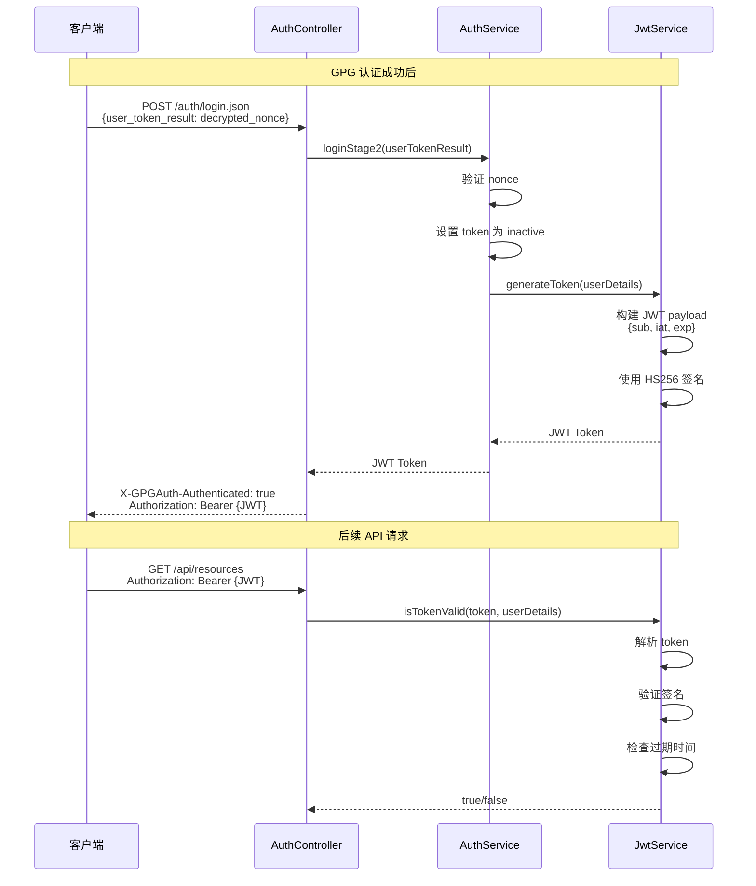

# JWT 认证实现详解

本文档详细说明 JPassbolt 中 JWT (JSON Web Token) 认证的实现原理和代码细节。

## 概述

在 Passbolt 中，GPG 认证成功后会颁发 JWT 令牌用于后续 API 请求的身份验证。JWT 提供了无状态的会话管理机制。

## JWT 结构

```
┌──────────────────────────────────────────────────────────────────────────┐
│                           JWT Token 结构                                  │
├──────────────────────────────────────────────────────────────────────────┤
│                                                                          │
│  Header          Payload            Signature                            │
│  ┌─────────┐     ┌─────────────┐    ┌─────────────────┐                 │
│  │ alg:HS256│     │ sub: userId │    │ HMACSHA256(     │                 │
│  │ typ:JWT  │  .  │ iss: issuer │  . │   base64(header)│                 │
│  └─────────┘     │ exp: expiry │    │   base64(payload)│                 │
│                  │ iat: issued │    │   secret         │                 │
│                  └─────────────┘    │ )                │                 │
│                                     └─────────────────┘                 │
│                                                                          │
│  例: eyJhbGc.eyJzdWI.SflKxwRJ                                            │
│                                                                          │
└──────────────────────────────────────────────────────────────────────────┘
```

---

## Java 实现

### JwtService.java

**文件**: [JwtService.java](file:///Users/chaucer/Code/gitlab/jpassbolt/jpassbolt_api/src/main/java/com/jpassbolt/api/service/JwtService.java)

#### 依赖

```xml
<!-- JWT Support (JJWT) -->
<dependency>
    <groupId>io.jsonwebtoken</groupId>
    <artifactId>jjwt-api</artifactId>
    <version>0.11.5</version>
</dependency>
<dependency>
    <groupId>io.jsonwebtoken</groupId>
    <artifactId>jjwt-impl</artifactId>
    <version>0.11.5</version>
    <scope>runtime</scope>
</dependency>
<dependency>
    <groupId>io.jsonwebtoken</groupId>
    <artifactId>jjwt-jackson</artifactId>
    <version>0.11.5</version>
    <scope>runtime</scope>
</dependency>
```

#### 配置

```yaml
jpassbolt:
  jwt:
    secret: REDACTED-LEGACY-HMAC
    expiration: 3600000  # 1 小时 (毫秒)
```

#### 完整实现

```java
@Service
public class JwtService {

    @Value("${jpassbolt.jwt.secret}")
    private String secretKey;

    @Value("${jpassbolt.jwt.expiration}")
    private long jwtExpiration;

    /**
     * 从 token 中提取用户名
     */
    public String extractUsername(String token) {
        return extractClaim(token, Claims::getSubject);
    }

    /**
     * 提取任意 claim
     */
    public <T> T extractClaim(String token, Function<Claims, T> claimsResolver) {
        final Claims claims = extractAllClaims(token);
        return claimsResolver.apply(claims);
    }

    /**
     * 生成 token (无额外 claims)
     */
    public String generateToken(UserDetails userDetails) {
        return generateToken(new HashMap<>(), userDetails);
    }

    /**
     * 生成 token (带额外 claims)
     */
    public String generateToken(Map<String, Object> extraClaims, UserDetails userDetails) {
        return buildToken(extraClaims, userDetails, jwtExpiration);
    }

    /**
     * 构建 token
     */
    private String buildToken(
            Map<String, Object> extraClaims,
            UserDetails userDetails,
            long expiration) {
        return Jwts
                .builder()
                .setClaims(extraClaims)                                    // 额外声明
                .setSubject(userDetails.getUsername())                     // 主题 (用户名)
                .setIssuedAt(new Date(System.currentTimeMillis()))        // 签发时间
                .setExpiration(new Date(System.currentTimeMillis() + expiration))  // 过期时间
                .signWith(getSignInKey(), SignatureAlgorithm.HS256)       // HS256 签名
                .compact();
    }

    /**
     * 验证 token 有效性
     */
    public boolean isTokenValid(String token, UserDetails userDetails) {
        final String username = extractUsername(token);
        return (username.equals(userDetails.getUsername())) && !isTokenExpired(token);
    }

    /**
     * 检查 token 是否过期
     */
    private boolean isTokenExpired(String token) {
        return extractExpiration(token).before(new Date());
    }

    /**
     * 提取过期时间
     */
    private Date extractExpiration(String token) {
        return extractClaim(token, Claims::getExpiration);
    }

    /**
     * 解析所有 claims
     */
    private Claims extractAllClaims(String token) {
        return Jwts
                .parserBuilder()
                .setSigningKey(getSignInKey())
                .build()
                .parseClaimsJws(token)
                .getBody();
    }

    /**
     * 获取签名密钥 (从 Base64 解码)
     */
    private Key getSignInKey() {
        byte[] keyBytes = Decoders.BASE64.decode(secretKey);
        return Keys.hmacShaKeyFor(keyBytes);
    }
}
```

---

## PHP 参考实现

### JwtTokenCreateService.php

**文件**: [JwtTokenCreateService.php](file:///Users/chaucer/Code/gitlab/jpassbolt/jpassbolt_api/passbolt_api_ref/plugins/PassboltCe/JwtAuthentication/src/Service/AccessToken/JwtTokenCreateService.php)

```php
class JwtTokenCreateService extends JwtAbstractService {
    public const JWT_SECRET_KEY_PATH = self::JWT_CONFIG_DIR . 'jwt.key';
    public const JWT_ALG = 'RS256';      // PHP 使用 RS256 (RSA 签名)
    public const JWT_KEY_LENGTH = 4096;
    public const JWT_EXPIRY_CONFIG_KEY = 'passbolt.auth.token.access_token.expiry';

    /**
     * 创建 JWT Token
     */
    public function createToken(string $userId, ?string $expiration = null): string {
        if (!Validation::uuid($userId)) {
            throw new InvalidArgumentException('The resource identifier should be a valid UUID.');
        }

        $privateKey = $this->readKeyFileContent();
        $payload = [
            'iss' => Router::url('/', true),   // 签发者 (服务器 URL)
            'sub' => $userId,                   // 主题 (用户 ID)
            'exp' => $this->createExpiryDate($expiration),  // 过期时间
        ];

        return JWT::encode($payload, $privateKey, self::JWT_ALG);
    }

    /**
     * 创建过期时间戳
     */
    public function createExpiryDate(?string $expirationPeriod = null): int {
        $expiryPeriod = $expirationPeriod ?? Configure::read(self::JWT_EXPIRY_CONFIG_KEY);
        return (int)(new DateTime('+' . $expiryPeriod))->toUnixString();
    }
}
```

---

## Java vs PHP 对照

| 特性 | Java (JJWT) | PHP (Firebase JWT) |
|------|-------------|-------------------|
| 库 | `io.jsonwebtoken:jjwt` | `firebase/php-jwt` |
| 签名算法 | HS256 (HMAC) | RS256 (RSA) |
| 密钥类型 | 对称密钥 (Secret) | 非对称密钥 (RSA 密钥对) |
| Token 主题 | `username` | `userId` (UUID) |
| 签发者 | 可选 | 必须 (服务器 URL) |

> [!NOTE]
> PHP 版本使用 RS256 (RSA 非对称加密)，需要 RSA 密钥对。Java 实现目前使用 HS256 (HMAC 对称加密)，使用共享密钥。生产环境建议迁移到 RS256。

---

## 认证流程中的 JWT



---

## JWT Claims 说明

### 标准 Claims

| Claim | 说明 | Java 方法 | PHP 键 |
|-------|------|-----------|--------|
| `sub` | 主题 (用户标识) | `setSubject()` | `'sub'` |
| `iss` | 签发者 | `setIssuer()` | `'iss'` |
| `exp` | 过期时间 (UNIX 时间戳) | `setExpiration()` | `'exp'` |
| `iat` | 签发时间 (UNIX 时间戳) | `setIssuedAt()` | 自动设置 |
| `nbf` | 生效时间 | `setNotBefore()` | `'nbf'` |
| `jti` | Token ID | `setId()` | `'jti'` |

### 自定义 Claims

```java
// 在 generateToken 时添加额外 claims
Map<String, Object> extraClaims = new HashMap<>();
extraClaims.put("role", "admin");
extraClaims.put("permissions", Arrays.asList("read", "write"));
jwtService.generateToken(extraClaims, userDetails);
```

---

## 数据库表

### authentication_tokens 表

用于存储各类认证 token，包括 GPG 登录 token 和 JWT refresh token。

| 字段 | 类型 | 说明 |
|------|------|------|
| `id` | CHAR(36) | 主键 UUID |
| `token` | CHAR(36) | Token UUID |
| `user_id` | CHAR(36) | 用户 ID |
| `type` | VARCHAR(16) | Token 类型 |
| `data` | TEXT | 附加数据 (JSON) |
| `active` | TINYINT(1) | 是否有效 |
| `created` | DATETIME | 创建时间 |
| `modified` | DATETIME | 修改时间 |

**Token 类型**:

| 类型 | 说明 |
|------|------|
| `login` | GPG 登录认证 |
| `register` | 用户注册 |
| `recover` | 密码恢复 |
| `mfa` | 多因素认证 |
| `refresh_token` | JWT 刷新 |
| `verify_token` | 验证 token |

### AuthenticationToken.java

**文件**: [AuthenticationToken.java](file:///Users/chaucer/Code/gitlab/jpassbolt/jpassbolt_api/src/main/java/com/jpassbolt/api/model/AuthenticationToken.java)

```java
@Entity
@Table(name = "authentication_tokens")
public class AuthenticationToken extends BaseEntity {
    @Column(name = "user_id", nullable = false, length = 36)
    private String userId;

    @Column(name = "token", nullable = false, length = 36)
    private String token;

    @Column(name = "type", nullable = false, length = 32)
    private String type;

    @Column(name = "data", columnDefinition = "TEXT")
    private String data;

    @Column(name = "active", nullable = false)
    private Boolean active = true;
}
```

---

## 安全考虑

### 1. 密钥管理

```yaml
# 生产环境应使用环境变量
jpassbolt:
  jwt:
    secret: ${JWT_SECRET}
```

### 2. Token 过期

```java
// 短期 Access Token (1 小时)
jwtExpiration: 3600000

// 可选：配合 Refresh Token 机制
refreshTokenExpiration: 604800000  // 7 天
```

### 3. 算法选择

| 算法 | 类型 | 推荐场景 |
|------|------|---------|
| HS256 | 对称加密 | 单体应用 |
| RS256 | 非对称加密 | 微服务架构 (公钥验证) |
| ES256 | 椭圆曲线 | 移动端 (密钥更短) |

---

## 相关文件

### Java 实现

| 文件 | 说明 |
|------|------|
| [JwtService.java](file:///Users/chaucer/Code/gitlab/jpassbolt/jpassbolt_api/src/main/java/com/jpassbolt/api/service/JwtService.java) | JWT 服务 |
| [AuthService.java](file:///Users/chaucer/Code/gitlab/jpassbolt/jpassbolt_api/src/main/java/com/jpassbolt/api/service/AuthService.java) | 认证服务 |
| [AuthenticationToken.java](file:///Users/chaucer/Code/gitlab/jpassbolt/jpassbolt_api/src/main/java/com/jpassbolt/api/model/AuthenticationToken.java) | Token 实体 |

### PHP 参考

| 文件 | 说明 |
|------|------|
| [JwtTokenCreateService.php](file:///Users/chaucer/Code/gitlab/jpassbolt/jpassbolt_api/passbolt_api_ref/plugins/PassboltCe/JwtAuthentication/src/Service/AccessToken/JwtTokenCreateService.php) | JWT 生成 |
| [JwtKeyPairService.php](file:///Users/chaucer/Code/gitlab/jpassbolt/jpassbolt_api/passbolt_api_ref/plugins/PassboltCe/JwtAuthentication/src/Service/AccessToken/JwtKeyPairService.php) | JWT 密钥对管理 |
| [GpgJwtAuthenticator.php](file:///Users/chaucer/Code/gitlab/jpassbolt/jpassbolt_api/passbolt_api_ref/plugins/PassboltCe/JwtAuthentication/src/Authenticator/GpgJwtAuthenticator.php) | GPG+JWT 认证器 |
| [JwtAuthenticationService.php](file:///Users/chaucer/Code/gitlab/jpassbolt/jpassbolt_api/passbolt_api_ref/plugins/PassboltCe/JwtAuthentication/src/Service/Middleware/JwtAuthenticationService.php) | JWT 认证服务 |
